# PropIQ — Entity Relationship Diagrams

> Generated from [`schema.mjs`](schema.mjs) by `node docs/erd/build.mjs` — **do not edit by hand**.
> **216 tables · 1729 key attributes · 391 relationships · 14 feature areas.**
> Open this file in VS Code (Markdown preview with a Mermaid extension) or on GitHub to see the diagrams.
> For the interactive viewer open [`viewer.html`](viewer.html). To edit visually, import [`erd.dbml`](erd.dbml) into https://dbdiagram.io.

**How to read.** Each box is a table. `PK` primary key · `FK` foreign key · `UK` unique. The line between two tables is a relationship: the single bar `||` end is the *parent* (one), the crow's-foot `o{` end is the *child* (many); a circle `o` means optional (nullable). Boxes that show only an `id` are tables from **another** feature area, shown so you can see the connection. Every table also has `company_id` (multi-company isolation) — those lines are not drawn, to keep the pictures readable.

## Map of the whole system

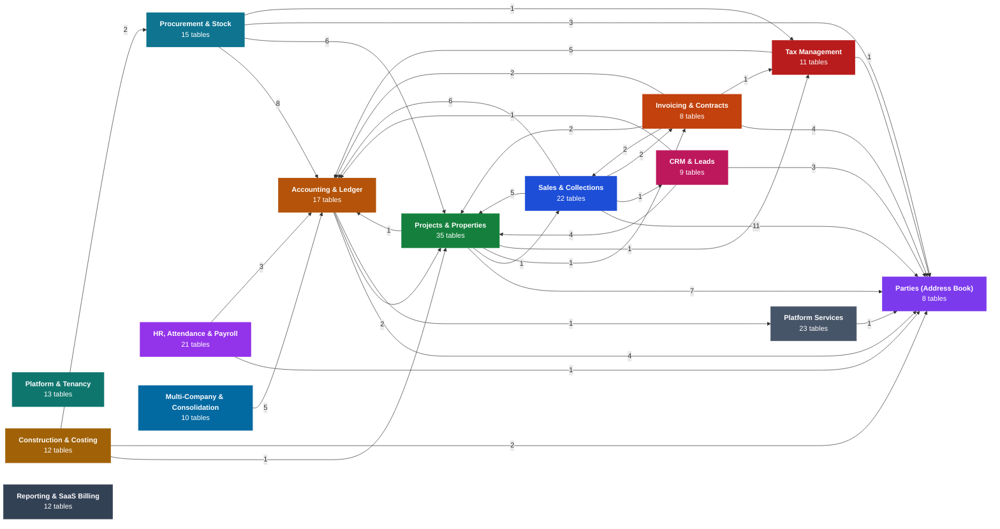
```mermaid
flowchart LR
  platform["<b>Platform & Tenancy</b><br/>13 tables"]
  services["<b>Platform Services</b><br/>23 tables"]
  parties["<b>Parties (Address Book)</b><br/>8 tables"]
  accounting["<b>Accounting & Ledger</b><br/>17 tables"]
  projects["<b>Projects & Properties</b><br/>35 tables"]
  crm["<b>CRM & Leads</b><br/>9 tables"]
  sales["<b>Sales & Collections</b><br/>22 tables"]
  tax["<b>Tax Management</b><br/>11 tables"]
  invoicing["<b>Invoicing & Contracts</b><br/>8 tables"]
  procurement["<b>Procurement & Stock</b><br/>15 tables"]
  construction["<b>Construction & Costing</b><br/>12 tables"]
  hr["<b>HR, Attendance & Payroll</b><br/>21 tables"]
  group["<b>Multi-Company & Consolidation</b><br/>10 tables"]
  saas["<b>Reporting & SaaS Billing</b><br/>12 tables"]
  services -->|1| parties
  accounting -->|4| parties
  accounting -->|2| projects
  accounting -->|1| services
  projects -->|7| parties
  projects -->|1| accounting
  projects -->|1| sales
  projects -->|1| invoicing
  projects -->|1| tax
  tax -->|5| accounting
  tax -->|1| parties
  group -->|5| accounting
  crm -->|4| projects
  crm -->|1| accounting
  crm -->|3| parties
  sales -->|11| parties
  sales -->|1| crm
  sales -->|5| projects
  sales -->|6| accounting
  sales -->|2| invoicing
  invoicing -->|4| parties
  invoicing -->|2| sales
  invoicing -->|2| accounting
  invoicing -->|1| tax
  invoicing -->|2| projects
  procurement -->|8| accounting
  procurement -->|6| projects
  procurement -->|3| parties
  procurement -->|1| tax
  construction -->|1| projects
  construction -->|2| parties
  construction -->|2| procurement
  hr -->|1| parties
  hr -->|3| accounting
  style platform fill:#0f766e,stroke:#0f766e,color:#fff
  style services fill:#475569,stroke:#475569,color:#fff
  style parties fill:#7c3aed,stroke:#7c3aed,color:#fff
  style accounting fill:#b45309,stroke:#b45309,color:#fff
  style projects fill:#15803d,stroke:#15803d,color:#fff
  style crm fill:#be185d,stroke:#be185d,color:#fff
  style sales fill:#1d4ed8,stroke:#1d4ed8,color:#fff
  style tax fill:#b91c1c,stroke:#b91c1c,color:#fff
  style invoicing fill:#c2410c,stroke:#c2410c,color:#fff
  style procurement fill:#0e7490,stroke:#0e7490,color:#fff
  style construction fill:#a16207,stroke:#a16207,color:#fff
  style hr fill:#9333ea,stroke:#9333ea,color:#fff
  style group fill:#0369a1,stroke:#0369a1,color:#fff
  style saas fill:#334155,stroke:#334155,color:#fff
```

## Platform & Tenancy (13 tables)

Groups, companies, users, roles, settings — who can do what, where.

### Identity & access (8)

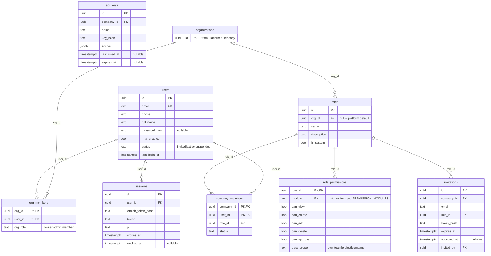
```mermaid
erDiagram
  users {
    uuid id PK
    text email UK
    text phone
    text full_name
    text password_hash "nullable"
    bool mfa_enabled
    text status "invited|active|suspended"
    timestamptz last_login_at
  }
  org_members {
    uuid org_id PK, FK
    uuid user_id PK, FK
    text org_role "owner|admin|member"
  }
  roles {
    uuid id PK
    uuid org_id FK "null = platform default"
    text name
    text description
    bool is_system
  }
  role_permissions {
    uuid role_id PK, FK
    text module PK "matches frontend PERMISSION_MODULES"
    bool can_view
    bool can_create
    bool can_edit
    bool can_delete
    bool can_approve
    text data_scope "own|team|project|company"
  }
  company_members {
    uuid company_id PK, FK
    uuid user_id PK, FK
    uuid role_id FK
    text status
  }
  invitations {
    uuid id PK
    uuid company_id FK
    text email
    uuid role_id FK
    text token_hash
    timestamptz expires_at
    timestamptz accepted_at "nullable"
    uuid invited_by FK
  }
  sessions {
    uuid id PK
    uuid user_id FK
    text refresh_token_hash
    text device
    text ip
    timestamptz expires_at
    timestamptz revoked_at "nullable"
  }
  api_keys {
    uuid id PK
    uuid company_id FK
    text name
    text key_hash
    jsonb scopes
    timestamptz last_used_at "nullable"
    timestamptz expires_at "nullable"
  }
  organizations {
    uuid id PK "from Platform & Tenancy"
  }
  organizations ||--o{ org_members : "org_id"
  users ||--o{ org_members : "user_id"
  organizations |o--o{ roles : "org_id"
  roles ||--o{ role_permissions : "role_id"
  users ||--o{ company_members : "user_id"
  roles ||--o{ company_members : "role_id"
  roles ||--o{ invitations : "role_id"
  users ||--o{ sessions : "user_id"
```

### Organization & settings (5)

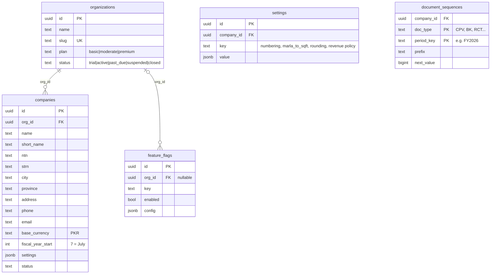
```mermaid
erDiagram
  organizations {
    uuid id PK
    text name
    text slug UK
    text plan "basic|moderate|premium"
    text status "trial|active|past_due|suspended|closed"
  }
  companies {
    uuid id PK
    uuid org_id FK
    text name
    text short_name
    text ntn
    text strn
    text city
    text province
    text address
    text phone
    text email
    text base_currency "PKR"
    int fiscal_year_start "7 = July"
    jsonb settings
    text status
  }
  settings {
    uuid id PK
    uuid company_id FK
    text key "numbering, marla_to_sqft, rounding, revenue policy"
    jsonb value
  }
  feature_flags {
    uuid id PK
    uuid org_id FK "nullable"
    text key
    bool enabled
    jsonb config
  }
  document_sequences {
    uuid company_id FK
    text doc_type PK "CPV, BK, RCT..."
    text period_key PK "e.g. FY2026"
    text prefix
    bigint next_value
  }
  organizations ||--o{ companies : "org_id"
  organizations |o--o{ feature_flags : "org_id"
```

## Platform Services (23 tables)

Audit, files, approvals, notifications, imports, webhooks — built once, used by every module.

### Audit, files & collaboration (8)

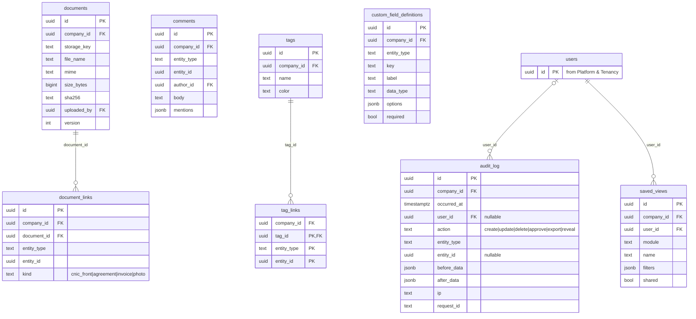
```mermaid
erDiagram
  audit_log {
    uuid id PK
    uuid company_id FK
    timestamptz occurred_at
    uuid user_id FK "nullable"
    text action "create|update|delete|approve|export|reveal"
    text entity_type
    uuid entity_id "nullable"
    jsonb before_data
    jsonb after_data
    text ip
    text request_id
  }
  documents {
    uuid id PK
    uuid company_id FK
    text storage_key
    text file_name
    text mime
    bigint size_bytes
    text sha256
    uuid uploaded_by FK
    int version
  }
  document_links {
    uuid id PK
    uuid company_id FK
    uuid document_id FK
    text entity_type
    uuid entity_id
    text kind "cnic_front|agreement|invoice|photo"
  }
  comments {
    uuid id PK
    uuid company_id FK
    text entity_type
    uuid entity_id
    uuid author_id FK
    text body
    jsonb mentions
  }
  tags {
    uuid id PK
    uuid company_id FK
    text name
    text color
  }
  tag_links {
    uuid company_id FK
    uuid tag_id PK, FK
    text entity_type PK
    uuid entity_id PK
  }
  custom_field_definitions {
    uuid id PK
    uuid company_id FK
    text entity_type
    text key
    text label
    text data_type
    jsonb options
    bool required
  }
  saved_views {
    uuid id PK
    uuid company_id FK
    uuid user_id FK
    text module
    text name
    jsonb filters
    bool shared
  }
  users {
    uuid id PK "from Platform & Tenancy"
  }
  users |o--o{ audit_log : "user_id"
  documents ||--o{ document_links : "document_id"
  tags ||--o{ tag_links : "tag_id"
  users ||--o{ saved_views : "user_id"
```

### Approvals & messaging (7)

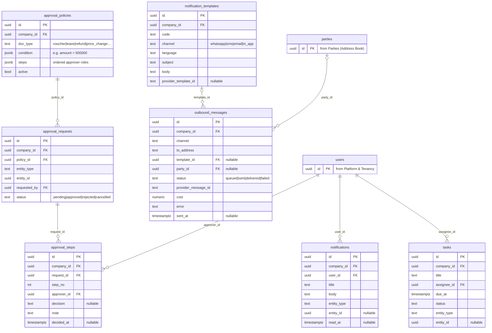
```mermaid
erDiagram
  approval_policies {
    uuid id PK
    uuid company_id FK
    text doc_type "voucher|leave|refund|price_change..."
    jsonb condition "e.g. amount > 500000"
    jsonb steps "ordered approver roles"
    bool active
  }
  approval_requests {
    uuid id PK
    uuid company_id FK
    uuid policy_id FK
    text entity_type
    uuid entity_id
    uuid requested_by FK
    text status "pending|approved|rejected|cancelled"
  }
  approval_steps {
    uuid id PK
    uuid company_id FK
    uuid request_id FK
    int step_no
    uuid approver_id FK
    text decision "nullable"
    text note
    timestamptz decided_at "nullable"
  }
  notification_templates {
    uuid id PK
    uuid company_id FK
    text code
    text channel "whatsapp|sms|email|in_app"
    text language
    text subject
    text body
    text provider_template_id "nullable"
  }
  notifications {
    uuid id PK
    uuid company_id FK
    uuid user_id FK
    text title
    text body
    text entity_type
    uuid entity_id "nullable"
    timestamptz read_at "nullable"
  }
  outbound_messages {
    uuid id PK
    uuid company_id FK
    text channel
    text to_address
    uuid template_id FK "nullable"
    uuid party_id FK "nullable"
    text status "queued|sent|delivered|failed"
    text provider_message_id
    numeric cost
    text error
    timestamptz sent_at "nullable"
  }
  tasks {
    uuid id PK
    uuid company_id FK
    text title
    uuid assignee_id FK
    timestamptz due_at
    text status
    text entity_type
    uuid entity_id "nullable"
  }
  users {
    uuid id PK "from Platform & Tenancy"
  }
  parties {
    uuid id PK "from Parties (Address Book)"
  }
  approval_policies ||--o{ approval_requests : "policy_id"
  approval_requests ||--o{ approval_steps : "request_id"
  users ||--o{ approval_steps : "approver_id"
  users ||--o{ notifications : "user_id"
  notification_templates |o--o{ outbound_messages : "template_id"
  parties |o--o{ outbound_messages : "party_id"
  users ||--o{ tasks : "assignee_id"
```

### Templates, imports & integrations (8)

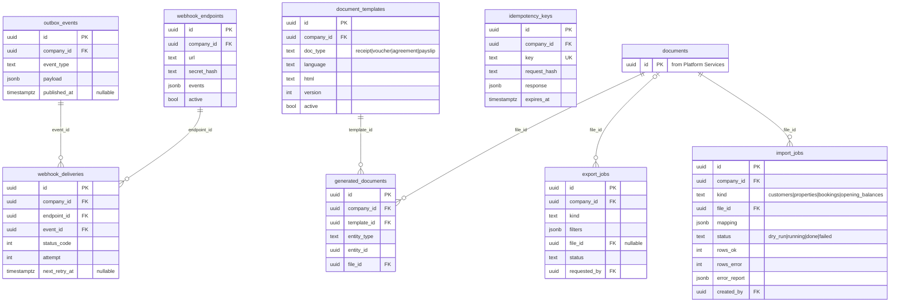
```mermaid
erDiagram
  import_jobs {
    uuid id PK
    uuid company_id FK
    text kind "customers|properties|bookings|opening_balances"
    uuid file_id FK
    jsonb mapping
    text status "dry_run|running|done|failed"
    int rows_ok
    int rows_error
    jsonb error_report
    uuid created_by FK
  }
  export_jobs {
    uuid id PK
    uuid company_id FK
    text kind
    jsonb filters
    uuid file_id FK "nullable"
    text status
    uuid requested_by FK
  }
  document_templates {
    uuid id PK
    uuid company_id FK
    text doc_type "receipt|voucher|agreement|payslip"
    text language
    text html
    int version
    bool active
  }
  generated_documents {
    uuid id PK
    uuid company_id FK
    uuid template_id FK
    text entity_type
    uuid entity_id
    uuid file_id FK
  }
  outbox_events {
    uuid id PK
    uuid company_id FK
    text event_type
    jsonb payload
    timestamptz published_at "nullable"
  }
  webhook_endpoints {
    uuid id PK
    uuid company_id FK
    text url
    text secret_hash
    jsonb events
    bool active
  }
  webhook_deliveries {
    uuid id PK
    uuid company_id FK
    uuid endpoint_id FK
    uuid event_id FK
    int status_code
    int attempt
    timestamptz next_retry_at "nullable"
  }
  idempotency_keys {
    uuid id PK
    uuid company_id FK
    text key UK
    text request_hash
    jsonb response
    timestamptz expires_at
  }
  documents {
    uuid id PK "from Platform Services"
  }
  documents ||--o{ import_jobs : "file_id"
  documents |o--o{ export_jobs : "file_id"
  document_templates ||--o{ generated_documents : "template_id"
  documents ||--o{ generated_documents : "file_id"
  webhook_endpoints ||--o{ webhook_deliveries : "endpoint_id"
  outbox_events ||--o{ webhook_deliveries : "event_id"
```

## Parties (Address Book) (8 tables)

Customers, dealers, vendors, contractors and owners as one deduplicated address book.

### All tables (8)

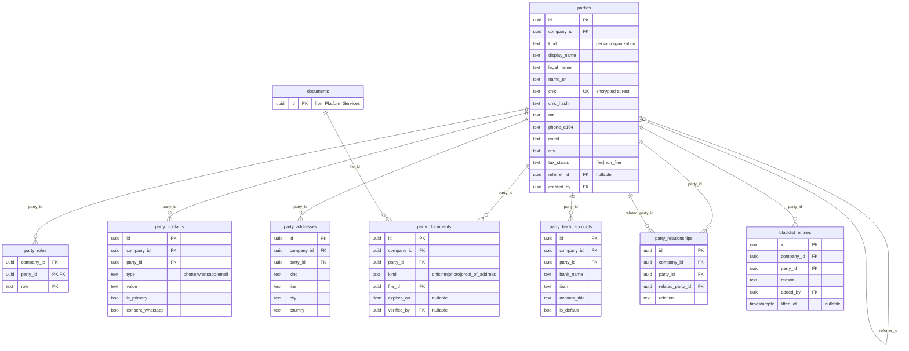
```mermaid
erDiagram
  parties {
    uuid id PK
    uuid company_id FK
    text kind "person|organization"
    text display_name
    text legal_name
    text name_ur
    text cnic UK "encrypted at rest"
    text cnic_hash
    text ntn
    text phone_e164
    text email
    text city
    text tax_status "filer|non_filer"
    uuid referrer_id FK "nullable"
    uuid created_by FK
  }
  party_roles {
    uuid company_id FK
    uuid party_id PK, FK
    text role PK
  }
  party_contacts {
    uuid id PK
    uuid company_id FK
    uuid party_id FK
    text type "phone|whatsapp|email"
    text value
    bool is_primary
    bool consent_whatsapp
  }
  party_addresses {
    uuid id PK
    uuid company_id FK
    uuid party_id FK
    text kind
    text line
    text city
    text country
  }
  party_documents {
    uuid id PK
    uuid company_id FK
    uuid party_id FK
    text kind "cnic|ntn|photo|proof_of_address"
    uuid file_id FK
    date expires_on "nullable"
    uuid verified_by FK "nullable"
  }
  party_bank_accounts {
    uuid id PK
    uuid company_id FK
    uuid party_id FK
    text bank_name
    text iban
    text account_title
    bool is_default
  }
  party_relationships {
    uuid id PK
    uuid company_id FK
    uuid party_id FK
    uuid related_party_id FK
    text relation
  }
  blacklist_entries {
    uuid id PK
    uuid company_id FK
    uuid party_id FK
    text reason
    uuid added_by FK
    timestamptz lifted_at "nullable"
  }
  documents {
    uuid id PK "from Platform Services"
  }
  parties |o--o{ parties : "referrer_id"
  parties ||--o{ party_roles : "party_id"
  parties ||--o{ party_contacts : "party_id"
  parties ||--o{ party_addresses : "party_id"
  parties ||--o{ party_documents : "party_id"
  documents ||--o{ party_documents : "file_id"
  parties ||--o{ party_bank_accounts : "party_id"
  parties ||--o{ party_relationships : "party_id"
  parties ||--o{ party_relationships : "related_party_id"
  parties ||--o{ blacklist_entries : "party_id"
```

## Accounting & Ledger (17 tables)

Chart of accounts (the structure) and vouchers (the documents) both post to one double-entry journal; combined transactions and bank reconciliation.

### Chart of accounts & ledger (9)

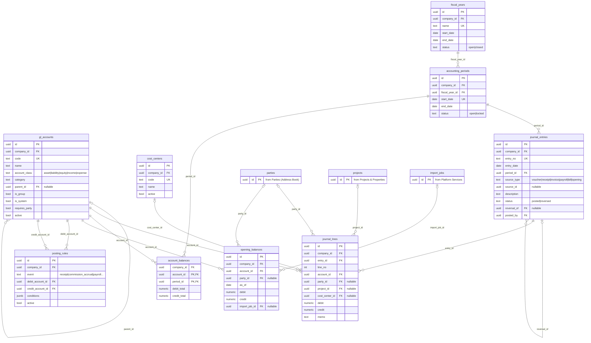
```mermaid
erDiagram
  fiscal_years {
    uuid id PK
    uuid company_id FK
    text name UK
    date start_date
    date end_date
    text status "open|closed"
  }
  accounting_periods {
    uuid id PK
    uuid company_id FK
    uuid fiscal_year_id FK
    date start_date UK
    date end_date
    text status "open|locked"
  }
  gl_accounts {
    uuid id PK
    uuid company_id FK
    text code UK
    text name
    text account_class "asset|liability|equity|income|expense"
    text category
    uuid parent_id FK "nullable"
    bool is_group
    bool is_system
    bool requires_party
    bool active
  }
  cost_centers {
    uuid id PK
    uuid company_id FK
    text code UK
    text name
    bool active
  }
  journal_entries {
    uuid id PK
    uuid company_id FK
    text entry_no UK
    date entry_date
    uuid period_id FK
    text source_type "voucher|receipt|invoice|payroll|bill|opening"
    uuid source_id "nullable"
    text description
    text status "posted|reversed"
    uuid reversal_of FK "nullable"
    uuid posted_by FK
  }
  journal_lines {
    uuid id PK
    uuid company_id FK
    uuid entry_id FK
    int line_no
    uuid account_id FK
    uuid party_id FK "nullable"
    uuid project_id FK "nullable"
    uuid cost_center_id FK "nullable"
    numeric debit
    numeric credit
    text memo
  }
  account_balances {
    uuid company_id FK
    uuid account_id PK, FK
    uuid period_id PK, FK
    numeric debit_total
    numeric credit_total
  }
  opening_balances {
    uuid id PK
    uuid company_id FK
    uuid account_id FK
    uuid party_id FK "nullable"
    date as_of
    numeric debit
    numeric credit
    uuid import_job_id FK "nullable"
  }
  posting_rules {
    uuid id PK
    uuid company_id FK
    text event "receipt|commission_accrual|payroll..."
    uuid debit_account_id FK
    uuid credit_account_id FK
    jsonb conditions
    bool active
  }
  parties {
    uuid id PK "from Parties (Address Book)"
  }
  projects {
    uuid id PK "from Projects & Properties"
  }
  import_jobs {
    uuid id PK "from Platform Services"
  }
  fiscal_years ||--o{ accounting_periods : "fiscal_year_id"
  gl_accounts |o--o{ gl_accounts : "parent_id"
  accounting_periods ||--o{ journal_entries : "period_id"
  journal_entries |o--o{ journal_entries : "reversal_of"
  journal_entries ||--o{ journal_lines : "entry_id"
  gl_accounts ||--o{ journal_lines : "account_id"
  parties |o--o{ journal_lines : "party_id"
  projects |o--o{ journal_lines : "project_id"
  cost_centers |o--o{ journal_lines : "cost_center_id"
  gl_accounts ||--o{ account_balances : "account_id"
  accounting_periods ||--o{ account_balances : "period_id"
  gl_accounts ||--o{ opening_balances : "account_id"
  parties |o--o{ opening_balances : "party_id"
  import_jobs |o--o{ opening_balances : "import_job_id"
  gl_accounts ||--o{ posting_rules : "debit_account_id"
  gl_accounts ||--o{ posting_rules : "credit_account_id"
```

### Vouchers & combined transactions (5)

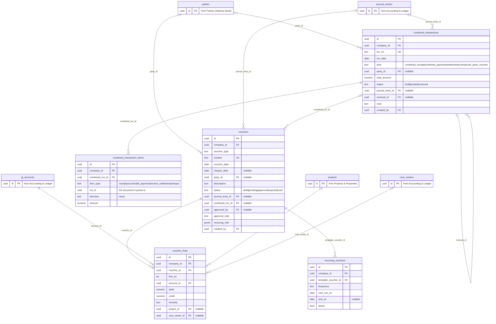
```mermaid
erDiagram
  vouchers {
    uuid id PK
    uuid company_id FK
    text voucher_type
    text number UK
    date voucher_date
    date cheque_date "nullable"
    uuid party_id FK "nullable"
    text description
    text status "draft|pending|approved|rejected|void"
    uuid journal_entry_id FK "nullable"
    uuid combined_txn_id FK "nullable"
    uuid approved_by FK "nullable"
    text approval_note
    jsonb recurring_rule
    uuid created_by FK
  }
  voucher_lines {
    uuid id PK
    uuid company_id FK
    uuid voucher_id FK
    int line_no
    uuid account_id FK
    numeric debit
    numeric credit
    text remarks
    uuid project_id FK "nullable"
    uuid cost_center_id FK "nullable"
  }
  recurring_vouchers {
    uuid id PK
    uuid company_id FK
    uuid template_voucher_id FK
    text frequency
    date next_run_on
    date end_on "nullable"
    bool active
  }
  combined_transactions {
    uuid id PK
    uuid company_id FK
    text txn_no UK
    date txn_date
    text kind "combined_receipt|combined_payment|settlement|contra|multi_party_voucher"
    uuid party_id FK "nullable"
    numeric total_amount
    text status "draft|posted|reversed"
    uuid journal_entry_id FK "nullable"
    uuid reversal_of FK "nullable"
    text note
    uuid created_by FK
  }
  combined_transaction_items {
    uuid id PK
    uuid company_id FK
    uuid combined_txn_id FK
    text item_type "receipt|voucher|bill_payment|invoice_settlement|cheque"
    uuid ref_id "the document it points to"
    text direction "in|out"
    numeric amount
  }
  parties {
    uuid id PK "from Parties (Address Book)"
  }
  journal_entries {
    uuid id PK "from Accounting & Ledger"
  }
  gl_accounts {
    uuid id PK "from Accounting & Ledger"
  }
  projects {
    uuid id PK "from Projects & Properties"
  }
  cost_centers {
    uuid id PK "from Accounting & Ledger"
  }
  parties |o--o{ vouchers : "party_id"
  journal_entries |o--o{ vouchers : "journal_entry_id"
  combined_transactions |o--o{ vouchers : "combined_txn_id"
  vouchers ||--o{ voucher_lines : "voucher_id"
  gl_accounts ||--o{ voucher_lines : "account_id"
  projects |o--o{ voucher_lines : "project_id"
  cost_centers |o--o{ voucher_lines : "cost_center_id"
  vouchers ||--o{ recurring_vouchers : "template_voucher_id"
  parties |o--o{ combined_transactions : "party_id"
  journal_entries |o--o{ combined_transactions : "journal_entry_id"
  combined_transactions |o--o{ combined_transactions : "reversal_of"
  combined_transactions ||--o{ combined_transaction_items : "combined_txn_id"
```

### Bank reconciliation (3)

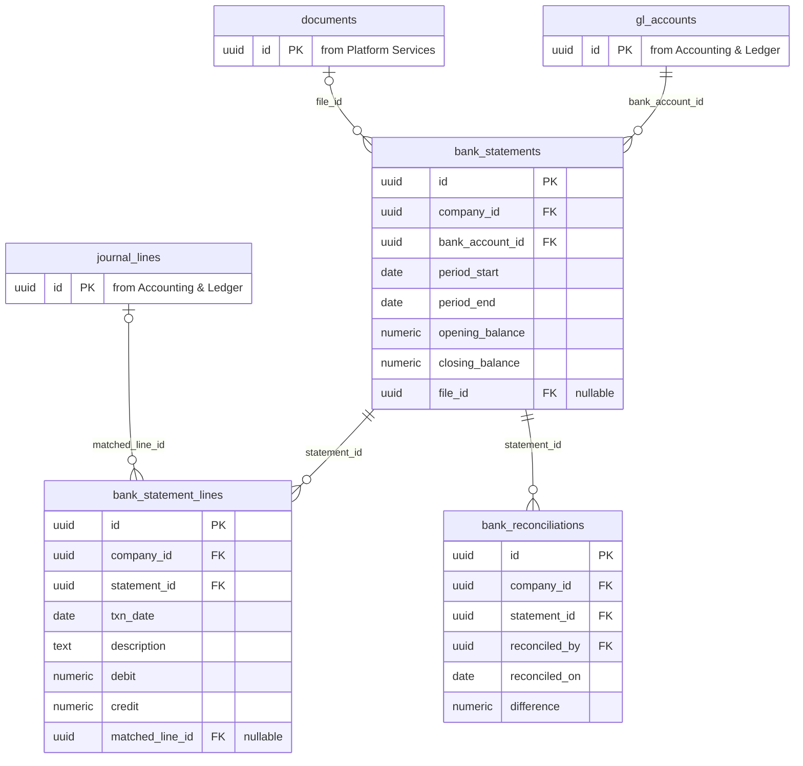
```mermaid
erDiagram
  bank_statements {
    uuid id PK
    uuid company_id FK
    uuid bank_account_id FK
    date period_start
    date period_end
    numeric opening_balance
    numeric closing_balance
    uuid file_id FK "nullable"
  }
  bank_statement_lines {
    uuid id PK
    uuid company_id FK
    uuid statement_id FK
    date txn_date
    text description
    numeric debit
    numeric credit
    uuid matched_line_id FK "nullable"
  }
  bank_reconciliations {
    uuid id PK
    uuid company_id FK
    uuid statement_id FK
    uuid reconciled_by FK
    date reconciled_on
    numeric difference
  }
  gl_accounts {
    uuid id PK "from Accounting & Ledger"
  }
  documents {
    uuid id PK "from Platform Services"
  }
  journal_lines {
    uuid id PK "from Accounting & Ledger"
  }
  gl_accounts ||--o{ bank_statements : "bank_account_id"
  documents |o--o{ bank_statements : "file_id"
  bank_statements ||--o{ bank_statement_lines : "statement_id"
  journal_lines |o--o{ bank_statement_lines : "matched_line_id"
  bank_statements ||--o{ bank_reconciliations : "statement_id"
```

## Projects & Properties (35 tables)

Schemes, land and approvals, plus a deep property model: location, size, plot/building/commercial specs, amenities, utilities, legal & ownership chain, valuation, media, listings and charges.

### Project & land (7)

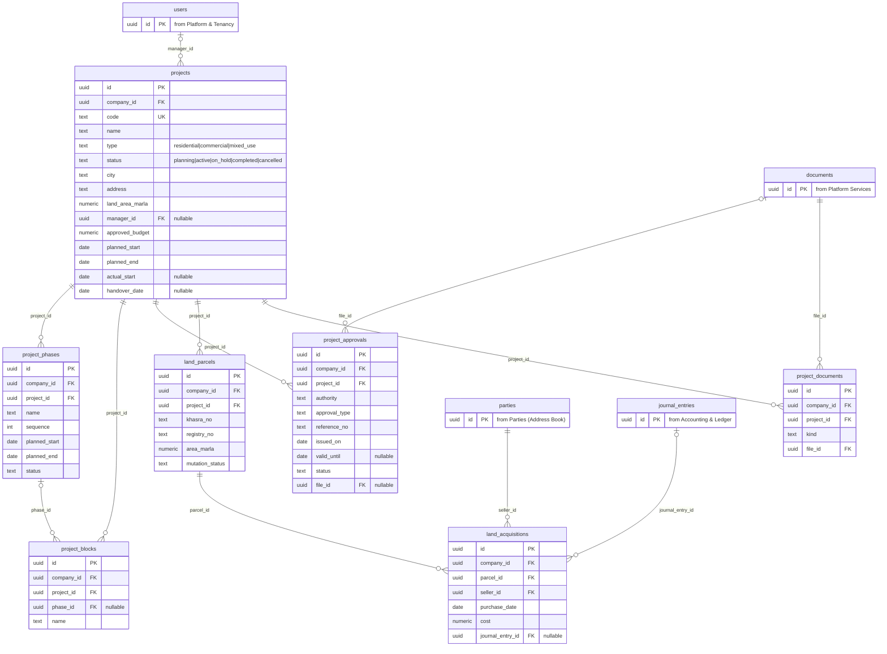
```mermaid
erDiagram
  projects {
    uuid id PK
    uuid company_id FK
    text code UK
    text name
    text type "residential|commercial|mixed_use"
    text status "planning|active|on_hold|completed|cancelled"
    text city
    text address
    numeric land_area_marla
    uuid manager_id FK "nullable"
    numeric approved_budget
    date planned_start
    date planned_end
    date actual_start "nullable"
    date handover_date "nullable"
  }
  project_phases {
    uuid id PK
    uuid company_id FK
    uuid project_id FK
    text name
    int sequence
    date planned_start
    date planned_end
    text status
  }
  project_blocks {
    uuid id PK
    uuid company_id FK
    uuid project_id FK
    uuid phase_id FK "nullable"
    text name
  }
  project_approvals {
    uuid id PK
    uuid company_id FK
    uuid project_id FK
    text authority
    text approval_type
    text reference_no
    date issued_on
    date valid_until "nullable"
    text status
    uuid file_id FK "nullable"
  }
  land_parcels {
    uuid id PK
    uuid company_id FK
    uuid project_id FK
    text khasra_no
    text registry_no
    numeric area_marla
    text mutation_status
  }
  land_acquisitions {
    uuid id PK
    uuid company_id FK
    uuid parcel_id FK
    uuid seller_id FK
    date purchase_date
    numeric cost
    uuid journal_entry_id FK "nullable"
  }
  project_documents {
    uuid id PK
    uuid company_id FK
    uuid project_id FK
    text kind
    uuid file_id FK
  }
  users {
    uuid id PK "from Platform & Tenancy"
  }
  documents {
    uuid id PK "from Platform Services"
  }
  parties {
    uuid id PK "from Parties (Address Book)"
  }
  journal_entries {
    uuid id PK "from Accounting & Ledger"
  }
  users |o--o{ projects : "manager_id"
  projects ||--o{ project_phases : "project_id"
  projects ||--o{ project_blocks : "project_id"
  project_phases |o--o{ project_blocks : "phase_id"
  projects ||--o{ project_approvals : "project_id"
  documents |o--o{ project_approvals : "file_id"
  projects ||--o{ land_parcels : "project_id"
  land_parcels ||--o{ land_acquisitions : "parcel_id"
  parties ||--o{ land_acquisitions : "seller_id"
  journal_entries |o--o{ land_acquisitions : "journal_entry_id"
  projects ||--o{ project_documents : "project_id"
  documents ||--o{ project_documents : "file_id"
```

### Property core & location (5)

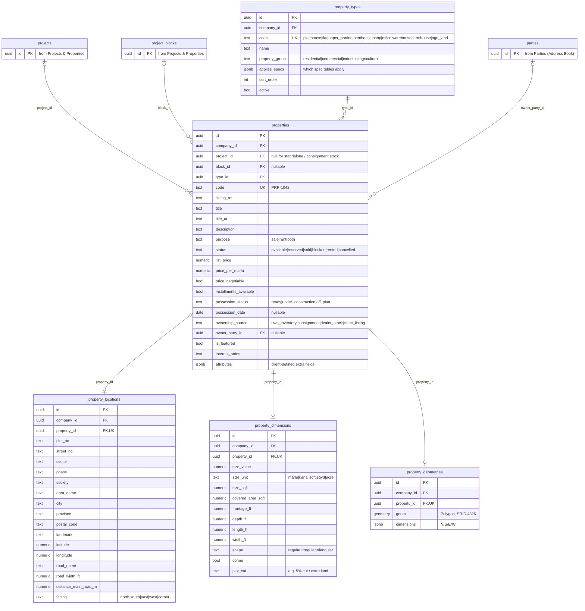
```mermaid
erDiagram
  property_types {
    uuid id PK
    uuid company_id FK
    text code UK "plot|house|flat|upper_portion|penthouse|shop|office|warehouse|farmhouse|agri_land..."
    text name
    text property_group "residential|commercial|industrial|agricultural"
    jsonb applies_specs "which spec tables apply"
    int sort_order
    bool active
  }
  properties {
    uuid id PK
    uuid company_id FK
    uuid project_id FK "null for standalone / consignment stock"
    uuid block_id FK "nullable"
    uuid type_id FK
    text code UK "PRP-1042"
    text listing_ref
    text title
    text title_ur
    text description
    text purpose "sale|rent|both"
    text status "available|reserved|sold|blocked|rented|cancelled"
    numeric list_price
    numeric price_per_marla
    bool price_negotiable
    bool installments_available
    text possession_status "ready|under_construction|off_plan"
    date possession_date "nullable"
    text ownership_source "own_inventory|consignment|dealer_stock|client_listing"
    uuid owner_party_id FK "nullable"
    bool is_featured
    text internal_notes
    jsonb attributes "client-defined extra fields"
  }
  property_locations {
    uuid id PK
    uuid company_id FK
    uuid property_id FK, UK
    text plot_no
    text street_no
    text sector
    text phase
    text society
    text area_name
    text city
    text province
    text postal_code
    text landmark
    numeric latitude
    numeric longitude
    text road_name
    numeric road_width_ft
    numeric distance_main_road_m
    text facing "north|south|east|west|corner..."
  }
  property_dimensions {
    uuid id PK
    uuid company_id FK
    uuid property_id FK, UK
    numeric size_value
    text size_unit "marla|kanal|sqft|sqyd|acre"
    numeric size_sqft
    numeric covered_area_sqft
    numeric frontage_ft
    numeric depth_ft
    numeric length_ft
    numeric width_ft
    text shape "regular|irregular|triangular"
    bool corner
    text plot_cut "e.g. 5% cut / extra land"
  }
  property_geometries {
    uuid id PK
    uuid company_id FK
    uuid property_id FK, UK
    geometry geom "Polygon, SRID 4326"
    jsonb dimensions "N/S/E/W"
  }
  projects {
    uuid id PK "from Projects & Properties"
  }
  project_blocks {
    uuid id PK "from Projects & Properties"
  }
  parties {
    uuid id PK "from Parties (Address Book)"
  }
  projects |o--o{ properties : "project_id"
  project_blocks |o--o{ properties : "block_id"
  property_types ||--o{ properties : "type_id"
  parties |o--o{ properties : "owner_party_id"
  properties ||--o| property_locations : "property_id"
  properties ||--o| property_dimensions : "property_id"
  properties ||--o| property_geometries : "property_id"
```

### Property specifications & features (7)

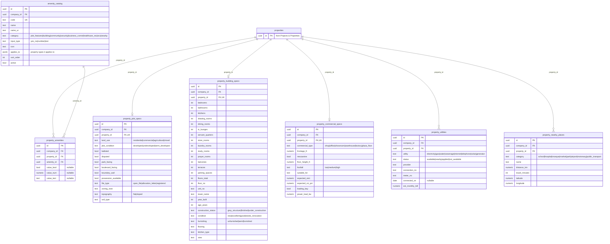
```mermaid
erDiagram
  property_plot_specs {
    uuid id PK
    uuid company_id FK
    uuid property_id FK, UK
    text land_use "residential|commercial|agricultural|mixed"
    text plot_condition "developed|undeveloped|semi_developed"
    bool balloted
    bool disputed
    bool park_facing
    bool boulevard_facing
    bool boundary_wall
    bool possession_available
    text file_type "open_file|allocation_letter|registered"
    text zoning_note
    text topography "flat|sloped"
    text soil_type
  }
  property_building_specs {
    uuid id PK
    uuid company_id FK
    uuid property_id FK, UK
    int bedrooms
    int bathrooms
    int kitchens
    int drawing_rooms
    int dining_rooms
    int tv_lounges
    int servant_quarters
    int store_rooms
    int laundry_rooms
    int study_rooms
    int prayer_rooms
    int balconies
    int terraces
    int parking_spaces
    int floors_total
    int floor_no
    text unit_no
    text tower_name
    int year_built
    int age_years
    text construction_status "grey_structure|finished|under_construction"
    text condition "new|excellent|good|needs_renovation"
    text furnishing "unfurnished|semi|furnished"
    text flooring
    text kitchen_type
    text view
  }
  property_commercial_specs {
    uuid id PK
    uuid company_id FK
    uuid property_id FK, UK
    text commercial_type "shop|office|showroom|warehouse|factory|plaza_floor"
    numeric frontage_ft
    bool mezzanine
    numeric floor_height_ft
    text footfall "low|medium|high"
    text suitable_for
    numeric expected_rent
    numeric expected_roi_pct
    bool loading_bay
    numeric power_load_kw
  }
  amenity_catalog {
    uuid id PK
    uuid company_id FK
    text code UK
    text name
    text name_ur
    text category "plot_features|building|community|security|business_comm|healthcare_rec|eco|nearby"
    text input_type "yes_no|number|text"
    text icon
    jsonb applies_to "property types it applies to"
    int sort_order
    bool active
  }
  property_amenities {
    uuid id PK
    uuid company_id FK
    uuid property_id FK
    uuid amenity_id FK
    bool value_bool "nullable"
    numeric value_num "nullable"
    text value_text "nullable"
  }
  property_utilities {
    uuid id PK
    uuid company_id FK
    uuid property_id FK
    text utility "electricity|gas|water|sewerage|internet|telephone|solar|generator"
    text status "available|nearby|applied|not_available"
    text provider
    text connection_no
    text meter_no
    date connected_on "nullable"
    numeric est_monthly_bill
  }
  property_nearby_places {
    uuid id PK
    uuid company_id FK
    uuid property_id FK
    text category "school|hospital|mosque|market|park|airport|motorway|public_transport"
    text name
    numeric distance_km
    int travel_minutes
    numeric latitude
    numeric longitude
  }
  properties {
    uuid id PK "from Projects & Properties"
  }
  properties ||--o| property_plot_specs : "property_id"
  properties ||--o| property_building_specs : "property_id"
  properties ||--o| property_commercial_specs : "property_id"
  properties ||--o{ property_amenities : "property_id"
  amenity_catalog ||--o{ property_amenities : "amenity_id"
  properties ||--o{ property_utilities : "property_id"
  properties ||--o{ property_nearby_places : "property_id"
```

### Property legal, ownership & valuation (7)

```mermaid
erDiagram
  property_legal {
    uuid id PK
    uuid company_id FK
    uuid property_id FK, UK
    text ownership_type "freehold|leasehold|allotment|power_of_attorney|file"
    text title_status "clear|under_verification|disputed"
    text registry_no
    text fard_no
    text khasra_no
    text allotment_no
    date allotment_date "nullable"
    text mutation_status
    text noc_status
    text transfer_status "transferable|restricted|transferred"
    date lease_start "nullable"
    date lease_end "nullable"
    numeric ground_rent
    text legal_notes
    uuid verified_by FK "nullable"
    date verified_on "nullable"
  }
  property_documents {
    uuid id PK
    uuid company_id FK
    uuid property_id FK
    text doc_type "registry|fard|allotment_letter|noc|sale_deed|site_plan|tax_receipt|utility_bill"
    uuid file_id FK
    text reference_no
    date issued_on "nullable"
    date expires_on "nullable"
    text status "pending|verified|rejected"
    uuid verified_by FK "nullable"
  }
  property_ownership_history {
    uuid id PK
    uuid company_id FK
    uuid property_id FK
    uuid owner_party_id FK
    text acquisition_type "purchase|inheritance|gift|allotment|transfer"
    date from_date
    date to_date "nullable"
    numeric price
    text deed_ref
    uuid booking_id FK "nullable"
  }
  property_encumbrances {
    uuid id PK
    uuid company_id FK
    uuid property_id FK
    text kind "mortgage|lien|court_stay|litigation|tenancy_right"
    uuid holder_party_id FK "nullable"
    numeric amount
    date since
    date released_on "nullable"
    text status "active|released"
    text notes
  }
  property_valuations {
    uuid id PK
    uuid company_id FK
    uuid property_id FK
    date valuation_date
    text method "market|bank|internal"
    numeric value
    uuid valuer_party_id FK "nullable"
    uuid report_file_id FK "nullable"
    text notes
  }
  property_inspections {
    uuid id PK
    uuid company_id FK
    uuid property_id FK
    date inspected_on
    uuid inspector_id FK
    int condition_rating "1-5"
    jsonb checklist
    text findings
    uuid report_file_id FK "nullable"
  }
  property_tenancies {
    uuid id PK
    uuid company_id FK
    uuid property_id FK
    uuid tenant_party_id FK
    numeric monthly_rent
    numeric security_deposit
    date start_date
    date end_date "nullable"
    text status "active|ended|notice"
    uuid agreement_contract_id FK "nullable"
  }
  properties {
    uuid id PK "from Projects & Properties"
  }
  documents {
    uuid id PK "from Platform Services"
  }
  parties {
    uuid id PK "from Parties (Address Book)"
  }
  bookings {
    uuid id PK "from Sales & Collections"
  }
  users {
    uuid id PK "from Platform & Tenancy"
  }
  contracts {
    uuid id PK "from Invoicing & Contracts"
  }
  properties ||--o| property_legal : "property_id"
  properties ||--o{ property_documents : "property_id"
  documents ||--o{ property_documents : "file_id"
  properties ||--o{ property_ownership_history : "property_id"
  parties ||--o{ property_ownership_history : "owner_party_id"
  bookings |o--o{ property_ownership_history : "booking_id"
  properties ||--o{ property_encumbrances : "property_id"
  parties |o--o{ property_encumbrances : "holder_party_id"
  properties ||--o{ property_valuations : "property_id"
  parties |o--o{ property_valuations : "valuer_party_id"
  documents |o--o{ property_valuations : "report_file_id"
  properties ||--o{ property_inspections : "property_id"
  users ||--o{ property_inspections : "inspector_id"
  documents |o--o{ property_inspections : "report_file_id"
  properties ||--o{ property_tenancies : "property_id"
  parties ||--o{ property_tenancies : "tenant_party_id"
  contracts |o--o{ property_tenancies : "agreement_contract_id"
```

### Property media, listings, pricing & charges (9)

```mermaid
erDiagram
  property_media {
    uuid id PK
    uuid company_id FK
    uuid property_id FK
    text kind "photo|video|tour_360|floor_plan|site_plan|drone|brochure"
    uuid file_id FK
    text caption
    int sort_order
    bool is_cover
    text visibility "public|internal"
    timestamptz taken_at
  }
  property_listings {
    uuid id PK
    uuid company_id FK
    uuid property_id FK
    text channel "website|zameen|olx|facebook|walk_in"
    text external_ref
    text listing_title
    text listing_description
    numeric asking_price
    text status "draft|live|paused|expired"
    timestamptz published_at "nullable"
    timestamptz expires_at "nullable"
    int views
    int inquiries
    timestamptz last_synced_at "nullable"
  }
  property_charges {
    uuid id PK
    uuid company_id FK
    uuid property_id FK
    text charge_type "development|transfer_fee|possession|maintenance|utility_connection|membership"
    numeric amount
    text basis "flat|per_marla|pct_of_price"
    text due_event "on_booking|on_possession|on_transfer"
    uuid tax_code_id FK "nullable"
  }
  price_lists {
    uuid id PK
    uuid company_id FK
    uuid project_id FK
    text name
    date effective_from
    date effective_to "nullable"
    uuid approved_by FK "nullable"
  }
  price_list_items {
    uuid id PK
    uuid company_id FK
    uuid price_list_id FK
    uuid property_id FK "nullable"
    text category
    numeric rate_per_marla "nullable"
    numeric price "nullable"
  }
  pricing_rules {
    uuid id PK
    uuid company_id FK
    uuid project_id FK
    text name
    jsonb condition
    numeric adjustment_pct
    bool active
  }
  property_price_history {
    uuid id PK
    uuid company_id FK
    uuid property_id FK
    numeric price
    timestamptz effective_from
    uuid changed_by FK
    text reason
  }
  property_status_history {
    uuid id PK
    uuid company_id FK
    uuid property_id FK
    text from_status
    text to_status
    uuid changed_by FK
    text reason
  }
  property_holds {
    uuid id PK
    uuid company_id FK
    uuid property_id FK
    uuid held_for_party_id FK "nullable"
    uuid held_by FK
    timestamptz expires_at
    timestamptz released_at "nullable"
  }
  properties {
    uuid id PK "from Projects & Properties"
  }
  documents {
    uuid id PK "from Platform Services"
  }
  tax_codes {
    uuid id PK "from Tax Management"
  }
  projects {
    uuid id PK "from Projects & Properties"
  }
  parties {
    uuid id PK "from Parties (Address Book)"
  }
  properties ||--o{ property_media : "property_id"
  documents ||--o{ property_media : "file_id"
  properties ||--o{ property_listings : "property_id"
  properties ||--o{ property_charges : "property_id"
  tax_codes |o--o{ property_charges : "tax_code_id"
  projects ||--o{ price_lists : "project_id"
  price_lists ||--o{ price_list_items : "price_list_id"
  properties |o--o{ price_list_items : "property_id"
  projects ||--o{ pricing_rules : "project_id"
  properties ||--o{ property_price_history : "property_id"
  properties ||--o{ property_status_history : "property_id"
  properties ||--o{ property_holds : "property_id"
  parties |o--o{ property_holds : "held_for_party_id"
```

## CRM & Leads (9 tables)

Leads, activities, site visits, campaigns, assignment and WhatsApp conversations.

### All tables (9)

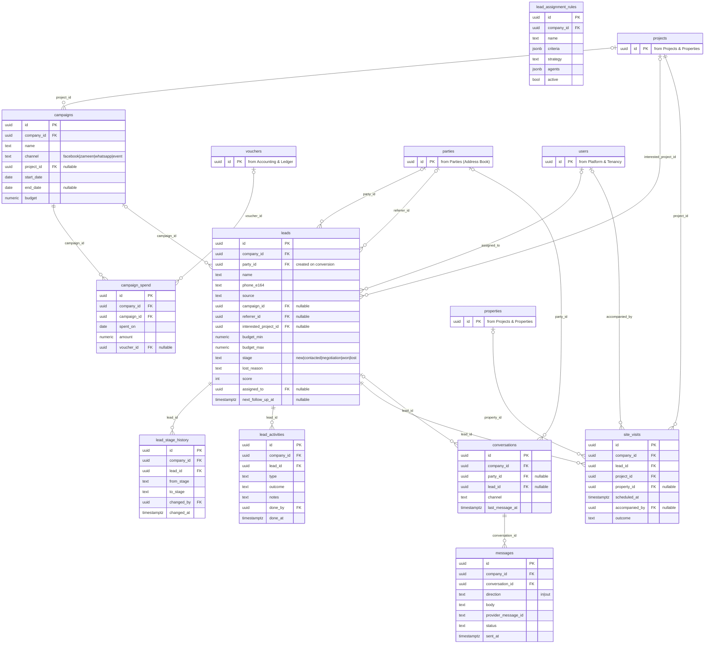
```mermaid
erDiagram
  campaigns {
    uuid id PK
    uuid company_id FK
    text name
    text channel "facebook|zameen|whatsapp|event"
    uuid project_id FK "nullable"
    date start_date
    date end_date "nullable"
    numeric budget
  }
  campaign_spend {
    uuid id PK
    uuid company_id FK
    uuid campaign_id FK
    date spent_on
    numeric amount
    uuid voucher_id FK "nullable"
  }
  leads {
    uuid id PK
    uuid company_id FK
    uuid party_id FK "created on conversion"
    text name
    text phone_e164
    text source
    uuid campaign_id FK "nullable"
    uuid referrer_id FK "nullable"
    uuid interested_project_id FK "nullable"
    numeric budget_min
    numeric budget_max
    text stage "new|contacted|negotiation|won|lost"
    text lost_reason
    int score
    uuid assigned_to FK "nullable"
    timestamptz next_follow_up_at "nullable"
  }
  lead_stage_history {
    uuid id PK
    uuid company_id FK
    uuid lead_id FK
    text from_stage
    text to_stage
    uuid changed_by FK
    timestamptz changed_at
  }
  lead_activities {
    uuid id PK
    uuid company_id FK
    uuid lead_id FK
    text type
    text outcome
    text notes
    uuid done_by FK
    timestamptz done_at
  }
  site_visits {
    uuid id PK
    uuid company_id FK
    uuid lead_id FK
    uuid project_id FK
    uuid property_id FK "nullable"
    timestamptz scheduled_at
    uuid accompanied_by FK "nullable"
    text outcome
  }
  lead_assignment_rules {
    uuid id PK
    uuid company_id FK
    text name
    jsonb criteria
    text strategy
    jsonb agents
    bool active
  }
  conversations {
    uuid id PK
    uuid company_id FK
    uuid party_id FK "nullable"
    uuid lead_id FK "nullable"
    text channel
    timestamptz last_message_at
  }
  messages {
    uuid id PK
    uuid company_id FK
    uuid conversation_id FK
    text direction "in|out"
    text body
    text provider_message_id
    text status
    timestamptz sent_at
  }
  projects {
    uuid id PK "from Projects & Properties"
  }
  vouchers {
    uuid id PK "from Accounting & Ledger"
  }
  parties {
    uuid id PK "from Parties (Address Book)"
  }
  users {
    uuid id PK "from Platform & Tenancy"
  }
  properties {
    uuid id PK "from Projects & Properties"
  }
  projects |o--o{ campaigns : "project_id"
  campaigns ||--o{ campaign_spend : "campaign_id"
  vouchers |o--o{ campaign_spend : "voucher_id"
  parties |o--o{ leads : "party_id"
  campaigns |o--o{ leads : "campaign_id"
  parties |o--o{ leads : "referrer_id"
  projects |o--o{ leads : "interested_project_id"
  users |o--o{ leads : "assigned_to"
  leads ||--o{ lead_stage_history : "lead_id"
  leads ||--o{ lead_activities : "lead_id"
  leads ||--o{ site_visits : "lead_id"
  projects ||--o{ site_visits : "project_id"
  properties |o--o{ site_visits : "property_id"
  users |o--o{ site_visits : "accompanied_by"
  parties |o--o{ conversations : "party_id"
  leads |o--o{ conversations : "lead_id"
  conversations ||--o{ messages : "conversation_id"
```

## Sales & Collections (22 tables)

Quotation → booking → installments → receipts, cheques, transfers, cancellations, commissions.

### Quotation & booking (7)

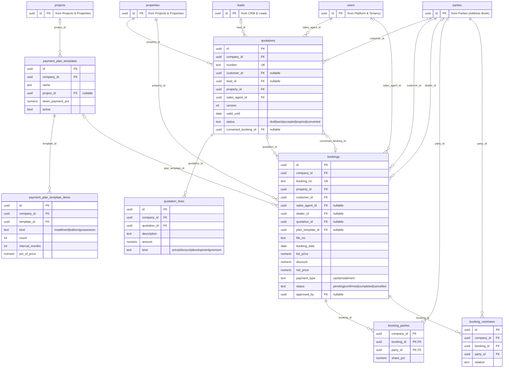
```mermaid
erDiagram
  quotations {
    uuid id PK
    uuid company_id FK
    text number UK
    uuid customer_id FK "nullable"
    uuid lead_id FK "nullable"
    uuid property_id FK
    uuid sales_agent_id FK
    int version
    date valid_until
    text status "draft|sent|accepted|expired|converted"
    uuid converted_booking_id FK "nullable"
  }
  quotation_lines {
    uuid id PK
    uuid company_id FK
    uuid quotation_id FK
    text description
    numeric amount
    text kind "price|discount|development|premium"
  }
  payment_plan_templates {
    uuid id PK
    uuid company_id FK
    text name
    uuid project_id FK "nullable"
    numeric down_payment_pct
    bool active
  }
  payment_plan_template_items {
    uuid id PK
    uuid company_id FK
    uuid template_id FK
    text kind "installment|balloon|possession"
    int count
    int interval_months
    numeric pct_of_price
  }
  bookings {
    uuid id PK
    uuid company_id FK
    text booking_no UK
    uuid property_id FK
    uuid customer_id FK
    uuid sales_agent_id FK "nullable"
    uuid dealer_id FK "nullable"
    uuid quotation_id FK "nullable"
    uuid plan_template_id FK "nullable"
    text file_no
    date booking_date
    numeric list_price
    numeric discount
    numeric net_price
    text payment_type "cash|installment"
    text status "pending|confirmed|completed|cancelled"
    uuid approved_by FK "nullable"
  }
  booking_parties {
    uuid company_id FK
    uuid booking_id PK, FK
    uuid party_id PK, FK
    numeric share_pct
  }
  booking_nominees {
    uuid id PK
    uuid company_id FK
    uuid booking_id FK
    uuid party_id FK
    text relation
  }
  parties {
    uuid id PK "from Parties (Address Book)"
  }
  leads {
    uuid id PK "from CRM & Leads"
  }
  properties {
    uuid id PK "from Projects & Properties"
  }
  users {
    uuid id PK "from Platform & Tenancy"
  }
  projects {
    uuid id PK "from Projects & Properties"
  }
  parties |o--o{ quotations : "customer_id"
  leads |o--o{ quotations : "lead_id"
  properties ||--o{ quotations : "property_id"
  users ||--o{ quotations : "sales_agent_id"
  bookings |o--o{ quotations : "converted_booking_id"
  quotations ||--o{ quotation_lines : "quotation_id"
  projects |o--o{ payment_plan_templates : "project_id"
  payment_plan_templates ||--o{ payment_plan_template_items : "template_id"
  properties ||--o{ bookings : "property_id"
  parties ||--o{ bookings : "customer_id"
  users |o--o{ bookings : "sales_agent_id"
  parties |o--o{ bookings : "dealer_id"
  quotations |o--o{ bookings : "quotation_id"
  payment_plan_templates |o--o{ bookings : "plan_template_id"
  bookings ||--o{ booking_parties : "booking_id"
  parties ||--o{ booking_parties : "party_id"
  bookings ||--o{ booking_nominees : "booking_id"
  parties ||--o{ booking_nominees : "party_id"
```

### Installments & penalties (5)

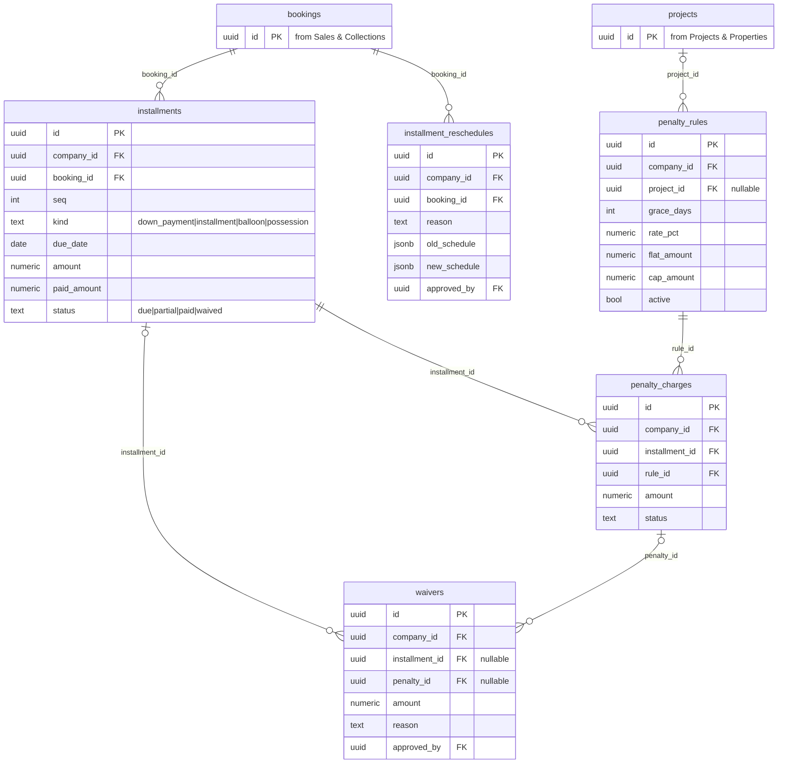
```mermaid
erDiagram
  installments {
    uuid id PK
    uuid company_id FK
    uuid booking_id FK
    int seq
    text kind "down_payment|installment|balloon|possession"
    date due_date
    numeric amount
    numeric paid_amount
    text status "due|partial|paid|waived"
  }
  installment_reschedules {
    uuid id PK
    uuid company_id FK
    uuid booking_id FK
    text reason
    jsonb old_schedule
    jsonb new_schedule
    uuid approved_by FK
  }
  penalty_rules {
    uuid id PK
    uuid company_id FK
    uuid project_id FK "nullable"
    int grace_days
    numeric rate_pct
    numeric flat_amount
    numeric cap_amount
    bool active
  }
  penalty_charges {
    uuid id PK
    uuid company_id FK
    uuid installment_id FK
    uuid rule_id FK
    numeric amount
    text status
  }
  waivers {
    uuid id PK
    uuid company_id FK
    uuid installment_id FK "nullable"
    uuid penalty_id FK "nullable"
    numeric amount
    text reason
    uuid approved_by FK
  }
  bookings {
    uuid id PK "from Sales & Collections"
  }
  projects {
    uuid id PK "from Projects & Properties"
  }
  bookings ||--o{ installments : "booking_id"
  bookings ||--o{ installment_reschedules : "booking_id"
  projects |o--o{ penalty_rules : "project_id"
  installments ||--o{ penalty_charges : "installment_id"
  penalty_rules ||--o{ penalty_charges : "rule_id"
  installments |o--o{ waivers : "installment_id"
  penalty_charges |o--o{ waivers : "penalty_id"
```

### Receipts (split tenders & allocations) (3)

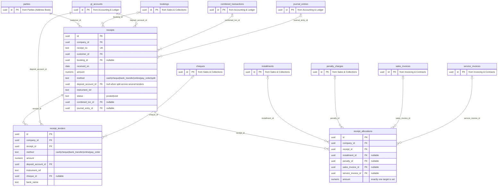
```mermaid
erDiagram
  receipts {
    uuid id PK
    uuid company_id FK
    text receipt_no UK
    uuid customer_id FK
    uuid booking_id FK "nullable"
    date received_on
    numeric amount
    text method "cash|cheque|bank_transfer|online|pay_order|split"
    uuid deposit_account_id FK "null when split across several tenders"
    text instrument_ref
    text status "posted|void"
    uuid combined_txn_id FK "nullable"
    uuid journal_entry_id FK "nullable"
  }
  receipt_tenders {
    uuid id PK
    uuid company_id FK
    uuid receipt_id FK
    text method "cash|cheque|bank_transfer|online|pay_order"
    numeric amount
    uuid deposit_account_id FK
    text instrument_ref
    uuid cheque_id FK "nullable"
    text bank_name
  }
  receipt_allocations {
    uuid id PK
    uuid company_id FK
    uuid receipt_id FK
    uuid installment_id FK "nullable"
    uuid penalty_id FK "nullable"
    uuid sales_invoice_id FK "nullable"
    uuid service_invoice_id FK "nullable"
    numeric amount "exactly one target is set"
  }
  parties {
    uuid id PK "from Parties (Address Book)"
  }
  bookings {
    uuid id PK "from Sales & Collections"
  }
  gl_accounts {
    uuid id PK "from Accounting & Ledger"
  }
  combined_transactions {
    uuid id PK "from Accounting & Ledger"
  }
  journal_entries {
    uuid id PK "from Accounting & Ledger"
  }
  cheques {
    uuid id PK "from Sales & Collections"
  }
  installments {
    uuid id PK "from Sales & Collections"
  }
  penalty_charges {
    uuid id PK "from Sales & Collections"
  }
  sales_invoices {
    uuid id PK "from Invoicing & Contracts"
  }
  service_invoices {
    uuid id PK "from Invoicing & Contracts"
  }
  parties ||--o{ receipts : "customer_id"
  bookings |o--o{ receipts : "booking_id"
  gl_accounts |o--o{ receipts : "deposit_account_id"
  combined_transactions |o--o{ receipts : "combined_txn_id"
  journal_entries |o--o{ receipts : "journal_entry_id"
  receipts ||--o{ receipt_tenders : "receipt_id"
  gl_accounts ||--o{ receipt_tenders : "deposit_account_id"
  cheques |o--o{ receipt_tenders : "cheque_id"
  receipts ||--o{ receipt_allocations : "receipt_id"
  installments |o--o{ receipt_allocations : "installment_id"
  penalty_charges |o--o{ receipt_allocations : "penalty_id"
  sales_invoices |o--o{ receipt_allocations : "sales_invoice_id"
  service_invoices |o--o{ receipt_allocations : "service_invoice_id"
```

### Cheques, commissions & after-sales (7)

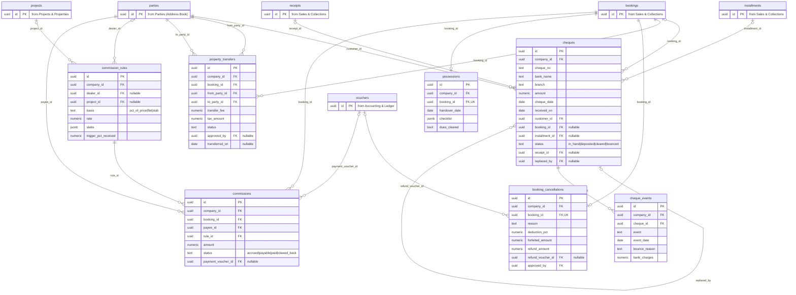
```mermaid
erDiagram
  cheques {
    uuid id PK
    uuid company_id FK
    text cheque_no
    text bank_name
    text branch
    numeric amount
    date cheque_date
    date received_on
    uuid customer_id FK
    uuid booking_id FK "nullable"
    uuid installment_id FK "nullable"
    text status "in_hand|deposited|cleared|bounced"
    uuid receipt_id FK "nullable"
    uuid replaced_by FK "nullable"
  }
  cheque_events {
    uuid id PK
    uuid company_id FK
    uuid cheque_id FK
    text event
    date event_date
    text bounce_reason
    numeric bank_charges
  }
  commission_rules {
    uuid id PK
    uuid company_id FK
    uuid dealer_id FK "nullable"
    uuid project_id FK "nullable"
    text basis "pct_of_price|flat|slab"
    numeric rate
    jsonb slabs
    numeric trigger_pct_received
  }
  commissions {
    uuid id PK
    uuid company_id FK
    uuid booking_id FK
    uuid payee_id FK
    uuid rule_id FK
    numeric amount
    text status "accrued|payable|paid|clawed_back"
    uuid payment_voucher_id FK "nullable"
  }
  property_transfers {
    uuid id PK
    uuid company_id FK
    uuid booking_id FK
    uuid from_party_id FK
    uuid to_party_id FK
    numeric transfer_fee
    numeric tax_amount
    text status
    uuid approved_by FK "nullable"
    date transferred_on "nullable"
  }
  booking_cancellations {
    uuid id PK
    uuid company_id FK
    uuid booking_id FK, UK
    text reason
    numeric deduction_pct
    numeric forfeited_amount
    numeric refund_amount
    uuid refund_voucher_id FK "nullable"
    uuid approved_by FK
  }
  possessions {
    uuid id PK
    uuid company_id FK
    uuid booking_id FK, UK
    date handover_date
    jsonb checklist
    bool dues_cleared
  }
  parties {
    uuid id PK "from Parties (Address Book)"
  }
  bookings {
    uuid id PK "from Sales & Collections"
  }
  installments {
    uuid id PK "from Sales & Collections"
  }
  receipts {
    uuid id PK "from Sales & Collections"
  }
  vouchers {
    uuid id PK "from Accounting & Ledger"
  }
  projects {
    uuid id PK "from Projects & Properties"
  }
  parties ||--o{ cheques : "customer_id"
  bookings |o--o{ cheques : "booking_id"
  installments |o--o{ cheques : "installment_id"
  receipts |o--o{ cheques : "receipt_id"
  cheques |o--o{ cheques : "replaced_by"
  cheques ||--o{ cheque_events : "cheque_id"
  bookings ||--o{ property_transfers : "booking_id"
  parties ||--o{ property_transfers : "from_party_id"
  parties ||--o{ property_transfers : "to_party_id"
  bookings ||--o| booking_cancellations : "booking_id"
  vouchers |o--o{ booking_cancellations : "refund_voucher_id"
  bookings ||--o| possessions : "booking_id"
  parties |o--o{ commission_rules : "dealer_id"
  projects |o--o{ commission_rules : "project_id"
  bookings ||--o{ commissions : "booking_id"
  parties ||--o{ commissions : "payee_id"
  commission_rules ||--o{ commissions : "rule_id"
  vouchers |o--o{ commissions : "payment_voucher_id"
```

## Tax Management (11 tables)

Admin-configurable tax codes, effective-dated rates, bundles, assignment rules, exemptions, returns and payments.

### Tax setup (codes, rates, bundles, rules) (7)

```mermaid
erDiagram
  tax_authorities {
    uuid id PK
    uuid company_id FK
    text name
    text short_code "FBR|PRA|SRB|KPRA|BRA"
    text registration_no
    text filing_frequency "monthly|quarterly|annual"
  }
  tax_codes {
    uuid id PK
    uuid company_id FK
    text code UK
    text name
    uuid authority_id FK "nullable"
    text kind "sales_tax|withholding|stamp_duty|capital_value|income_tax|other"
    text direction "output|input|withheld_by_us|withheld_from_us"
    text applies_on "revenue|expense|payroll|transfer|any"
    text calc_method "percent|flat|slab"
    bool price_inclusive
    text rounding "nearest|up|down"
    uuid payable_account_id FK "nullable"
    uuid receivable_account_id FK "nullable"
    uuid expense_account_id FK "nullable"
    bool active
  }
  tax_rates {
    uuid id PK
    uuid company_id FK
    uuid tax_code_id FK
    numeric rate_pct "nullable"
    numeric flat_amount "nullable"
    jsonb slabs "[{from, to, rate}]"
    numeric min_base "nullable"
    numeric max_base "nullable"
    text filer_status "filer|non_filer|any"
    date effective_from
    date effective_to "nullable"
    text note
  }
  tax_groups {
    uuid id PK
    uuid company_id FK
    text name UK
    text description
    bool active
  }
  tax_group_items {
    uuid company_id FK
    uuid group_id PK, FK
    uuid tax_code_id PK, FK
    int sequence
    bool compound "tax on top of previous tax"
  }
  tax_assignments {
    uuid id PK
    uuid company_id FK
    text name
    text doc_type "booking|receipt|sales_invoice|service_invoice|vendor_bill|payroll|transfer|commission|voucher"
    uuid tax_group_id FK
    jsonb conditions "property type, project, filer status, amount range …"
    int priority
    date effective_from
    date effective_to "nullable"
    bool active
  }
  party_tax_exemptions {
    uuid id PK
    uuid company_id FK
    uuid party_id FK
    uuid tax_code_id FK
    text certificate_no
    date valid_from
    date valid_to "nullable"
    uuid file_id FK "nullable"
  }
  gl_accounts {
    uuid id PK "from Accounting & Ledger"
  }
  parties {
    uuid id PK "from Parties (Address Book)"
  }
  documents {
    uuid id PK "from Platform Services"
  }
  tax_authorities |o--o{ tax_codes : "authority_id"
  gl_accounts |o--o{ tax_codes : "payable_account_id"
  gl_accounts |o--o{ tax_codes : "receivable_account_id"
  gl_accounts |o--o{ tax_codes : "expense_account_id"
  tax_codes ||--o{ tax_rates : "tax_code_id"
  tax_groups ||--o{ tax_group_items : "group_id"
  tax_codes ||--o{ tax_group_items : "tax_code_id"
  tax_groups ||--o{ tax_assignments : "tax_group_id"
  parties ||--o{ party_tax_exemptions : "party_id"
  tax_codes ||--o{ party_tax_exemptions : "tax_code_id"
  documents |o--o{ party_tax_exemptions : "file_id"
```

### Tax computed, returns & payments (4)

```mermaid
erDiagram
  document_taxes {
    uuid id PK
    uuid company_id FK
    text doc_type
    uuid doc_id
    uuid tax_code_id FK
    uuid tax_rate_id FK "nullable"
    numeric base_amount
    numeric rate_pct
    numeric tax_amount
    text direction "output|input|withheld_by_us|withheld_from_us"
    text status "computed|posted|reversed"
    text override_reason "nullable"
    uuid journal_entry_id FK "nullable"
  }
  tax_returns {
    uuid id PK
    uuid company_id FK
    uuid authority_id FK
    text tax_type
    date period_start
    date period_end
    numeric total_output
    numeric total_input
    numeric net_payable
    text status "draft|filed|paid"
    date filed_on "nullable"
    text reference_no
    uuid file_id FK "nullable"
  }
  tax_return_lines {
    uuid company_id FK
    uuid return_id PK, FK
    uuid document_tax_id PK, FK
  }
  tax_payments {
    uuid id PK
    uuid company_id FK
    uuid return_id FK "nullable"
    uuid tax_code_id FK
    numeric amount
    date paid_on
    text challan_no
    uuid voucher_id FK "nullable"
  }
  tax_codes {
    uuid id PK "from Tax Management"
  }
  tax_rates {
    uuid id PK "from Tax Management"
  }
  journal_entries {
    uuid id PK "from Accounting & Ledger"
  }
  tax_authorities {
    uuid id PK "from Tax Management"
  }
  documents {
    uuid id PK "from Platform Services"
  }
  vouchers {
    uuid id PK "from Accounting & Ledger"
  }
  tax_codes ||--o{ document_taxes : "tax_code_id"
  tax_rates |o--o{ document_taxes : "tax_rate_id"
  journal_entries |o--o{ document_taxes : "journal_entry_id"
  tax_authorities ||--o{ tax_returns : "authority_id"
  documents |o--o{ tax_returns : "file_id"
  tax_returns ||--o{ tax_return_lines : "return_id"
  document_taxes ||--o{ tax_return_lines : "document_tax_id"
  tax_returns |o--o{ tax_payments : "return_id"
  tax_codes ||--o{ tax_payments : "tax_code_id"
  vouchers |o--o{ tax_payments : "voucher_id"
```

## Invoicing & Contracts (8 tables)

Sales and service invoices, recurring billing, credit notes, agreement templates.

### All tables (8)

```mermaid
erDiagram
  sales_invoices {
    uuid id PK
    uuid company_id FK
    text number UK
    uuid customer_id FK
    uuid booking_id FK "nullable"
    date invoice_date
    date due_date
    numeric subtotal
    numeric tax_amount
    numeric total
    text status "unpaid|partial|paid|void"
    uuid journal_entry_id FK "nullable"
  }
  sales_invoice_lines {
    uuid id PK
    uuid company_id FK
    uuid invoice_id FK
    text description
    numeric quantity
    numeric rate
    uuid tax_code_id FK "nullable"
    numeric tax_amount
    numeric amount
  }
  billing_schedules {
    uuid id PK
    uuid company_id FK
    uuid customer_id FK
    uuid property_id FK "nullable"
    text service_type "maintenance|security|utility"
    numeric amount
    text frequency
    date next_run_on
    bool active
  }
  service_invoices {
    uuid id PK
    uuid company_id FK
    text number UK
    uuid schedule_id FK "nullable"
    uuid customer_id FK
    uuid property_id FK "nullable"
    text period_label
    date due_date
    numeric amount
    text status
  }
  credit_notes {
    uuid id PK
    uuid company_id FK
    uuid invoice_id FK
    numeric amount
    text reason
    uuid journal_entry_id FK "nullable"
  }
  contract_templates {
    uuid id PK
    uuid company_id FK
    text kind "sale|lease|dealer|employment"
    text language
    text body_html
    jsonb merge_fields
    bool active
  }
  contracts {
    uuid id PK
    uuid company_id FK
    text number UK
    uuid template_id FK "nullable"
    text kind
    text title
    uuid booking_id FK "nullable"
    date start_date
    date end_date
    text status "draft|active|expiring|expired|terminated"
    numeric value
    uuid signed_file_id FK "nullable"
    uuid renewal_of FK "nullable"
  }
  contract_parties {
    uuid company_id FK
    uuid contract_id PK, FK
    uuid party_id PK, FK
    text role
  }
  parties {
    uuid id PK "from Parties (Address Book)"
  }
  bookings {
    uuid id PK "from Sales & Collections"
  }
  journal_entries {
    uuid id PK "from Accounting & Ledger"
  }
  tax_codes {
    uuid id PK "from Tax Management"
  }
  properties {
    uuid id PK "from Projects & Properties"
  }
  documents {
    uuid id PK "from Platform Services"
  }
  parties ||--o{ sales_invoices : "customer_id"
  bookings |o--o{ sales_invoices : "booking_id"
  journal_entries |o--o{ sales_invoices : "journal_entry_id"
  sales_invoices ||--o{ sales_invoice_lines : "invoice_id"
  tax_codes |o--o{ sales_invoice_lines : "tax_code_id"
  parties ||--o{ billing_schedules : "customer_id"
  properties |o--o{ billing_schedules : "property_id"
  billing_schedules |o--o{ service_invoices : "schedule_id"
  parties ||--o{ service_invoices : "customer_id"
  properties |o--o{ service_invoices : "property_id"
  sales_invoices ||--o{ credit_notes : "invoice_id"
  journal_entries |o--o{ credit_notes : "journal_entry_id"
  contract_templates |o--o{ contracts : "template_id"
  bookings |o--o{ contracts : "booking_id"
  documents |o--o{ contracts : "signed_file_id"
  contracts |o--o{ contracts : "renewal_of"
  contracts ||--o{ contract_parties : "contract_id"
  parties ||--o{ contract_parties : "party_id"
```

## Procurement & Stock (15 tables)

Vendors' POs, goods receipts, bills, budgets, petty cash and material stock.

### Purchasing & vendor bills (9)

```mermaid
erDiagram
  expense_categories {
    uuid id PK
    uuid company_id FK
    text name
    uuid account_id FK
    uuid parent_id FK "nullable"
  }
  purchase_requests {
    uuid id PK
    uuid company_id FK
    text number UK
    uuid project_id FK "nullable"
    uuid requested_by FK
    text status
    date needed_by
  }
  purchase_orders {
    uuid id PK
    uuid company_id FK
    text number UK
    uuid vendor_id FK
    uuid project_id FK "nullable"
    uuid request_id FK "nullable"
    date order_date
    numeric total
    text status "draft|approved|received|closed"
    uuid approved_by FK "nullable"
  }
  po_lines {
    uuid id PK
    uuid company_id FK
    uuid po_id FK
    uuid stock_item_id FK "nullable"
    text description
    numeric quantity
    numeric rate
    numeric amount
  }
  goods_receipts {
    uuid id PK
    uuid company_id FK
    uuid po_id FK
    uuid warehouse_id FK "nullable"
    date received_on
    uuid received_by FK
  }
  vendor_bills {
    uuid id PK
    uuid company_id FK
    text number UK
    uuid vendor_id FK
    uuid po_id FK "nullable"
    uuid project_id FK "nullable"
    uuid category_id FK
    date bill_date
    date due_date
    numeric subtotal
    numeric tax_amount
    numeric total
    text status "unpaid|partial|paid|void"
    uuid journal_entry_id FK "nullable"
  }
  bill_lines {
    uuid id PK
    uuid company_id FK
    uuid bill_id FK
    text description
    uuid account_id FK
    uuid project_id FK "nullable"
    uuid cost_center_id FK "nullable"
    uuid tax_code_id FK "nullable"
    numeric tax_amount
    numeric amount
  }
  bill_payments {
    uuid company_id FK
    uuid bill_id PK, FK
    uuid voucher_id PK, FK
    numeric amount
  }
  recurring_templates {
    uuid id PK
    uuid company_id FK
    uuid vendor_id FK
    uuid category_id FK
    numeric amount
    text frequency
    date next_run_on
  }
  gl_accounts {
    uuid id PK "from Accounting & Ledger"
  }
  projects {
    uuid id PK "from Projects & Properties"
  }
  parties {
    uuid id PK "from Parties (Address Book)"
  }
  stock_items {
    uuid id PK "from Procurement & Stock"
  }
  warehouses {
    uuid id PK "from Procurement & Stock"
  }
  journal_entries {
    uuid id PK "from Accounting & Ledger"
  }
  cost_centers {
    uuid id PK "from Accounting & Ledger"
  }
  tax_codes {
    uuid id PK "from Tax Management"
  }
  vouchers {
    uuid id PK "from Accounting & Ledger"
  }
  gl_accounts ||--o{ expense_categories : "account_id"
  expense_categories |o--o{ expense_categories : "parent_id"
  projects |o--o{ purchase_requests : "project_id"
  parties ||--o{ purchase_orders : "vendor_id"
  projects |o--o{ purchase_orders : "project_id"
  purchase_requests |o--o{ purchase_orders : "request_id"
  purchase_orders ||--o{ po_lines : "po_id"
  stock_items |o--o{ po_lines : "stock_item_id"
  purchase_orders ||--o{ goods_receipts : "po_id"
  warehouses |o--o{ goods_receipts : "warehouse_id"
  parties ||--o{ vendor_bills : "vendor_id"
  purchase_orders |o--o{ vendor_bills : "po_id"
  projects |o--o{ vendor_bills : "project_id"
  expense_categories ||--o{ vendor_bills : "category_id"
  journal_entries |o--o{ vendor_bills : "journal_entry_id"
  vendor_bills ||--o{ bill_lines : "bill_id"
  gl_accounts ||--o{ bill_lines : "account_id"
  projects |o--o{ bill_lines : "project_id"
  cost_centers |o--o{ bill_lines : "cost_center_id"
  tax_codes |o--o{ bill_lines : "tax_code_id"
  vendor_bills ||--o{ bill_payments : "bill_id"
  vouchers ||--o{ bill_payments : "voucher_id"
  parties ||--o{ recurring_templates : "vendor_id"
  expense_categories ||--o{ recurring_templates : "category_id"
```

### Budgets, petty cash & stock (6)

```mermaid
erDiagram
  budgets {
    uuid id PK
    uuid company_id FK
    uuid project_id FK
    text name
    uuid fiscal_year_id FK "nullable"
    text status
  }
  budget_lines {
    uuid id PK
    uuid company_id FK
    uuid budget_id FK
    text cost_code
    uuid account_id FK "nullable"
    numeric amount
  }
  petty_cash_floats {
    uuid id PK
    uuid company_id FK
    uuid custodian_id FK
    uuid account_id FK
    numeric float_amount
  }
  warehouses {
    uuid id PK
    uuid company_id FK
    text name
    uuid project_id FK "nullable"
  }
  stock_items {
    uuid id PK
    uuid company_id FK
    text sku UK
    text name
    text unit
    numeric avg_cost
    numeric reorder_level
  }
  stock_movements {
    uuid id PK
    uuid company_id FK
    uuid item_id FK
    uuid warehouse_id FK
    text movement_type "receipt|issue|transfer|adjustment"
    numeric quantity
    numeric unit_cost
    text ref_type
    uuid ref_id "nullable"
    date moved_on
  }
  projects {
    uuid id PK "from Projects & Properties"
  }
  fiscal_years {
    uuid id PK "from Accounting & Ledger"
  }
  gl_accounts {
    uuid id PK "from Accounting & Ledger"
  }
  users {
    uuid id PK "from Platform & Tenancy"
  }
  projects ||--o{ budgets : "project_id"
  fiscal_years |o--o{ budgets : "fiscal_year_id"
  budgets ||--o{ budget_lines : "budget_id"
  gl_accounts |o--o{ budget_lines : "account_id"
  users ||--o{ petty_cash_floats : "custodian_id"
  gl_accounts ||--o{ petty_cash_floats : "account_id"
  projects |o--o{ warehouses : "project_id"
  stock_items ||--o{ stock_movements : "item_id"
  warehouses ||--o{ stock_movements : "warehouse_id"
```

## Construction & Costing (12 tables)

Contracts, BOQ, running bills (IPC), retention, variations, progress and guarantees.

### Contracts & running bills (6)

```mermaid
erDiagram
  construction_contracts {
    uuid id PK
    uuid company_id FK
    text number UK
    uuid project_id FK
    uuid contractor_id FK
    text scope_of_work
    numeric contract_value
    numeric retention_pct
    numeric advance_amount
    date start_date
    date end_date
    text status "active|completed|terminated"
    numeric progress_pct
  }
  contract_items {
    uuid id PK
    uuid company_id FK
    uuid contract_id FK
    text cost_code
    text description
    text unit
    numeric quantity
    numeric rate
    numeric amount
  }
  ipcs {
    uuid id PK
    uuid company_id FK
    uuid contract_id FK
    int ipc_no
    date period_end
    numeric gross_amount
    numeric retention_held
    numeric advance_recovered
    numeric other_deductions
    numeric net_payable
    text status "draft|approved|paid"
    uuid bill_id FK "nullable"
  }
  ipc_lines {
    uuid id PK
    uuid company_id FK
    uuid ipc_id FK
    uuid item_id FK
    numeric quantity_this_period
    numeric cumulative_quantity
    numeric amount
  }
  retention_ledger {
    uuid id PK
    uuid company_id FK
    uuid contract_id FK
    uuid ipc_id FK "nullable"
    numeric amount "+ held, - released"
    date event_date
    text note
  }
  variation_orders {
    uuid id PK
    uuid company_id FK
    uuid contract_id FK
    text description
    numeric amount
    text status
    uuid approved_by FK "nullable"
  }
  projects {
    uuid id PK "from Projects & Properties"
  }
  parties {
    uuid id PK "from Parties (Address Book)"
  }
  vendor_bills {
    uuid id PK "from Procurement & Stock"
  }
  projects ||--o{ construction_contracts : "project_id"
  parties ||--o{ construction_contracts : "contractor_id"
  construction_contracts ||--o{ contract_items : "contract_id"
  construction_contracts ||--o{ ipcs : "contract_id"
  vendor_bills |o--o{ ipcs : "bill_id"
  ipcs ||--o{ ipc_lines : "ipc_id"
  contract_items ||--o{ ipc_lines : "item_id"
  construction_contracts ||--o{ retention_ledger : "contract_id"
  ipcs |o--o{ retention_ledger : "ipc_id"
  construction_contracts ||--o{ variation_orders : "contract_id"
```

### Progress, quality & materials (6)

```mermaid
erDiagram
  milestones {
    uuid id PK
    uuid company_id FK
    uuid contract_id FK
    text name
    date planned_date
    date actual_date "nullable"
    numeric weight_pct
  }
  progress_reports {
    uuid id PK
    uuid company_id FK
    uuid contract_id FK
    date report_date
    numeric progress_pct
    text notes
    uuid reported_by FK
  }
  progress_photos {
    uuid id PK
    uuid company_id FK
    uuid report_id FK
    uuid file_id FK
    text caption
    timestamptz taken_at
    geometry geom "nullable"
  }
  contractor_ratings {
    uuid id PK
    uuid company_id FK
    uuid contractor_id FK
    uuid contract_id FK "nullable"
    int rating
    text comment
    uuid rated_by FK
  }
  guarantees {
    uuid id PK
    uuid company_id FK
    uuid contract_id FK
    text kind
    text reference_no
    numeric amount
    date expires_on
    uuid file_id FK "nullable"
  }
  material_issues {
    uuid id PK
    uuid company_id FK
    uuid contract_id FK
    uuid stock_movement_id FK
    numeric value
  }
  construction_contracts {
    uuid id PK "from Construction & Costing"
  }
  documents {
    uuid id PK "from Platform Services"
  }
  parties {
    uuid id PK "from Parties (Address Book)"
  }
  stock_movements {
    uuid id PK "from Procurement & Stock"
  }
  construction_contracts ||--o{ milestones : "contract_id"
  construction_contracts ||--o{ progress_reports : "contract_id"
  progress_reports ||--o{ progress_photos : "report_id"
  documents ||--o{ progress_photos : "file_id"
  parties ||--o{ contractor_ratings : "contractor_id"
  construction_contracts |o--o{ contractor_ratings : "contract_id"
  construction_contracts ||--o{ guarantees : "contract_id"
  documents |o--o{ guarantees : "file_id"
  construction_contracts ||--o{ material_issues : "contract_id"
  stock_movements ||--o{ material_issues : "stock_movement_id"
```

## HR, Attendance & Payroll (21 tables)

Employees, salary structure, attendance, leave, payroll runs, loans, targets.

### Employees & salary structure (6)

```mermaid
erDiagram
  departments {
    uuid id PK
    uuid company_id FK
    text name UK
    uuid head_employee_id FK "nullable"
  }
  designations {
    uuid id PK
    uuid company_id FK
    text name UK
    int level
  }
  employees {
    uuid id PK
    uuid company_id FK
    uuid party_id FK, UK
    uuid user_id FK, UK "login, if any"
    text employee_no UK
    uuid department_id FK
    uuid designation_id FK
    uuid manager_id FK "nullable"
    text employment_type
    date joined_on
    date probation_end "nullable"
    date confirmed_on "nullable"
    date exit_date "nullable"
    text bank_iban
    text status
  }
  salary_components {
    uuid id PK
    uuid company_id FK
    text code UK
    text name
    text kind "earning|deduction"
    bool taxable
    jsonb formula
  }
  employee_salary_components {
    uuid id PK
    uuid company_id FK
    uuid employee_id FK
    uuid component_id FK
    numeric amount
    date effective_from
    date effective_to "nullable"
  }
  salary_history {
    uuid id PK
    uuid company_id FK
    uuid employee_id FK
    numeric previous_total
    numeric new_total
    date effective_date
    text reason
    uuid approved_by FK
  }
  parties {
    uuid id PK "from Parties (Address Book)"
  }
  users {
    uuid id PK "from Platform & Tenancy"
  }
  employees |o--o{ departments : "head_employee_id"
  parties ||--o| employees : "party_id"
  users |o--o| employees : "user_id"
  departments ||--o{ employees : "department_id"
  designations ||--o{ employees : "designation_id"
  employees |o--o{ employees : "manager_id"
  employees ||--o{ employee_salary_components : "employee_id"
  salary_components ||--o{ employee_salary_components : "component_id"
  employees ||--o{ salary_history : "employee_id"
```

### Attendance & leave (8)

```mermaid
erDiagram
  shifts {
    uuid id PK
    uuid company_id FK
    text name
    text start_time
    text end_time
    int grace_minutes
  }
  attendance_logs {
    uuid id PK
    uuid company_id FK
    uuid employee_id FK
    timestamptz logged_at
    text direction
    text source "web|mobile|biometric"
    geometry geom "nullable"
  }
  attendance_daily {
    uuid id PK
    uuid company_id FK
    uuid employee_id FK
    date work_date
    uuid shift_id FK "nullable"
    text status "present|absent|leave|holiday"
    int late_minutes
    int overtime_minutes
  }
  holidays {
    uuid id PK
    uuid company_id FK
    date holiday_date
    text name
  }
  leave_types {
    uuid id PK
    uuid company_id FK
    text name UK
    bool paid
    bool carry_forward
  }
  leave_policies {
    uuid id PK
    uuid company_id FK
    uuid leave_type_id FK
    numeric annual_days
    text accrual
    numeric max_carry
  }
  leave_balances {
    uuid id PK
    uuid company_id FK
    uuid employee_id FK
    uuid leave_type_id FK
    int year
    numeric entitled
    numeric used
    numeric carried
  }
  leave_requests {
    uuid id PK
    uuid company_id FK
    uuid employee_id FK
    uuid leave_type_id FK
    date from_date
    date to_date
    numeric days
    text reason
    text status "pending|approved|rejected"
    uuid approved_by FK "nullable"
  }
  employees {
    uuid id PK "from HR, Attendance & Payroll"
  }
  employees ||--o{ attendance_logs : "employee_id"
  employees ||--o{ attendance_daily : "employee_id"
  shifts |o--o{ attendance_daily : "shift_id"
  leave_types ||--o{ leave_policies : "leave_type_id"
  employees ||--o{ leave_balances : "employee_id"
  leave_types ||--o{ leave_balances : "leave_type_id"
  employees ||--o{ leave_requests : "employee_id"
  leave_types ||--o{ leave_requests : "leave_type_id"
```

### Payroll, loans & targets (7)

```mermaid
erDiagram
  payroll_runs {
    uuid id PK
    uuid company_id FK
    uuid period_id FK
    text month
    text status "draft|reviewed|approved|disbursed|locked"
    numeric total_gross
    numeric total_net
    uuid journal_entry_id FK "nullable"
    uuid approved_by FK "nullable"
  }
  payslips {
    uuid id PK
    uuid company_id FK
    uuid run_id FK
    uuid employee_id FK
    numeric gross
    numeric deductions
    numeric net
    uuid pdf_file_id FK "nullable"
  }
  payslip_lines {
    uuid id PK
    uuid company_id FK
    uuid payslip_id FK
    uuid component_id FK "nullable"
    text label
    text kind
    numeric amount
  }
  staff_loans {
    uuid id PK
    uuid company_id FK
    uuid employee_id FK
    numeric principal
    int installments
    date issued_on
    text status
    uuid approved_by FK
    uuid voucher_id FK "nullable"
  }
  loan_installments {
    uuid id PK
    uuid company_id FK
    uuid loan_id FK
    text due_month
    numeric amount
    uuid recovered_in_payslip_id FK "nullable"
  }
  sales_targets {
    uuid id PK
    uuid company_id FK
    uuid employee_id FK
    text month
    numeric target_amount
    numeric achieved_amount
  }
  incentive_rules {
    uuid id PK
    uuid company_id FK
    text name
    text basis
    numeric rate
    jsonb slabs
    bool active
  }
  accounting_periods {
    uuid id PK "from Accounting & Ledger"
  }
  journal_entries {
    uuid id PK "from Accounting & Ledger"
  }
  employees {
    uuid id PK "from HR, Attendance & Payroll"
  }
  documents {
    uuid id PK "from Platform Services"
  }
  salary_components {
    uuid id PK "from HR, Attendance & Payroll"
  }
  vouchers {
    uuid id PK "from Accounting & Ledger"
  }
  accounting_periods ||--o{ payroll_runs : "period_id"
  journal_entries |o--o{ payroll_runs : "journal_entry_id"
  payroll_runs ||--o{ payslips : "run_id"
  employees ||--o{ payslips : "employee_id"
  documents |o--o{ payslips : "pdf_file_id"
  payslips ||--o{ payslip_lines : "payslip_id"
  salary_components |o--o{ payslip_lines : "component_id"
  employees ||--o{ staff_loans : "employee_id"
  vouchers |o--o{ staff_loans : "voucher_id"
  staff_loans ||--o{ loan_installments : "loan_id"
  payslips |o--o{ loan_installments : "recovered_in_payslip_id"
  employees ||--o{ sales_targets : "employee_id"
```

## Multi-Company & Consolidation (10 tables)

Inter-company transactions, group chart of accounts, eliminations and consolidated statements.

### Inter-company transactions (2)

```mermaid
erDiagram
  intercompany_accounts {
    uuid id PK
    uuid company_id FK
    uuid counterparty_company_id FK
    uuid due_from_account_id FK
    uuid due_to_account_id FK
  }
  intercompany_transactions {
    uuid id PK
    uuid org_id FK
    text txn_no UK
    uuid from_company_id FK
    uuid to_company_id FK
    text kind "loan|repayment|fund_transfer|expense_recharge|sale|commission"
    date txn_date
    numeric amount
    text description
    text status "draft|posted|settled|reversed"
    uuid from_entry_id FK "nullable"
    uuid to_entry_id FK "nullable"
    timestamptz matched_at "nullable"
    uuid created_by FK
  }
  companies {
    uuid id PK "from Platform & Tenancy"
  }
  gl_accounts {
    uuid id PK "from Accounting & Ledger"
  }
  organizations {
    uuid id PK "from Platform & Tenancy"
  }
  journal_entries {
    uuid id PK "from Accounting & Ledger"
  }
  companies ||--o{ intercompany_accounts : "counterparty_company_id"
  gl_accounts ||--o{ intercompany_accounts : "due_from_account_id"
  gl_accounts ||--o{ intercompany_accounts : "due_to_account_id"
  organizations ||--o{ intercompany_transactions : "org_id"
  companies ||--o{ intercompany_transactions : "from_company_id"
  companies ||--o{ intercompany_transactions : "to_company_id"
  journal_entries |o--o{ intercompany_transactions : "from_entry_id"
  journal_entries |o--o{ intercompany_transactions : "to_entry_id"
```

### Consolidation & eliminations (8)

```mermaid
erDiagram
  consolidation_groups {
    uuid id PK
    uuid org_id FK
    text name
    text base_currency
    text status
  }
  consolidation_members {
    uuid group_id PK, FK
    uuid company_id PK, FK
    numeric ownership_pct
    text method "full|proportional|equity"
  }
  group_accounts {
    uuid id PK
    uuid org_id FK
    text code
    text name
    text account_class
    uuid parent_id FK "nullable"
  }
  group_account_map {
    uuid company_id PK, FK
    uuid gl_account_id PK, FK
    uuid group_account_id FK
  }
  consolidation_runs {
    uuid id PK
    uuid group_id FK
    date period_start
    date period_end
    text status "draft|final"
    uuid run_by FK
    timestamptz run_at
  }
  consolidated_balances {
    uuid run_id PK, FK
    uuid group_account_id PK, FK
    numeric debit_total
    numeric credit_total
  }
  elimination_entries {
    uuid id PK
    uuid run_id FK
    text kind "intercompany|investment|unrealized_profit"
    text description
    uuid intercompany_txn_id FK "nullable"
  }
  elimination_lines {
    uuid id PK
    uuid entry_id FK
    uuid group_account_id FK
    uuid company_id FK "nullable"
    numeric debit
    numeric credit
  }
  organizations {
    uuid id PK "from Platform & Tenancy"
  }
  gl_accounts {
    uuid id PK "from Accounting & Ledger"
  }
  users {
    uuid id PK "from Platform & Tenancy"
  }
  intercompany_transactions {
    uuid id PK "from Multi-Company & Consolidation"
  }
  organizations ||--o{ consolidation_groups : "org_id"
  consolidation_groups ||--o{ consolidation_members : "group_id"
  organizations ||--o{ group_accounts : "org_id"
  group_accounts |o--o{ group_accounts : "parent_id"
  gl_accounts ||--o{ group_account_map : "gl_account_id"
  group_accounts ||--o{ group_account_map : "group_account_id"
  consolidation_groups ||--o{ consolidation_runs : "group_id"
  users ||--o{ consolidation_runs : "run_by"
  consolidation_runs ||--o{ consolidated_balances : "run_id"
  group_accounts ||--o{ consolidated_balances : "group_account_id"
  consolidation_runs ||--o{ elimination_entries : "run_id"
  intercompany_transactions |o--o{ elimination_entries : "intercompany_txn_id"
  elimination_entries ||--o{ elimination_lines : "entry_id"
  group_accounts ||--o{ elimination_lines : "group_account_id"
```

## Reporting & SaaS Billing (12 tables)

KPI snapshots, saved/scheduled reports, plans, subscriptions and usage.

### Reporting (3)

```mermaid
erDiagram
  company_kpi_snapshots {
    uuid id PK
    uuid company_id FK
    date snapshot_date
    int properties
    int available
    numeric collections
    numeric cash
    numeric receivable
    numeric overdue
  }
  saved_reports {
    uuid id PK
    uuid company_id FK
    text name
    text module
    jsonb definition
    uuid owner_id FK
    bool shared
  }
  report_schedules {
    uuid id PK
    uuid company_id FK
    uuid report_id FK
    text cron
    jsonb recipients
    text format
    timestamptz last_run_at "nullable"
  }
  users {
    uuid id PK "from Platform & Tenancy"
  }
  users ||--o{ saved_reports : "owner_id"
  saved_reports ||--o{ report_schedules : "report_id"
```

### Subscription billing (9)

```mermaid
erDiagram
  plans {
    uuid id PK
    text code UK
    text name
    numeric price_monthly
  }
  plan_limits {
    uuid id PK
    uuid plan_id FK
    text limit_key
    int limit_value
  }
  subscriptions {
    uuid id PK
    uuid org_id FK
    uuid plan_id FK
    text status "trial|active|past_due|cancelled"
    date current_period_end
    timestamptz cancel_at "nullable"
  }
  subscription_items {
    uuid id PK
    uuid subscription_id FK
    text item_key
    int quantity
  }
  usage_meters {
    uuid id PK
    uuid org_id FK
    text meter
    numeric value
    date recorded_on
  }
  saas_invoices {
    uuid id PK
    uuid org_id FK
    uuid subscription_id FK
    numeric amount
    text status
    date due_date
  }
  saas_payments {
    uuid id PK
    uuid invoice_id FK
    text method "card|jazzcash|easypaisa|bank"
    numeric amount
    text reference
    timestamptz paid_at
  }
  dunning_events {
    uuid id PK
    uuid invoice_id FK
    int attempt
    timestamptz sent_at
  }
  coupons {
    uuid id PK
    text code UK
    numeric percent_off
    date valid_until "nullable"
  }
  organizations {
    uuid id PK "from Platform & Tenancy"
  }
  plans ||--o{ plan_limits : "plan_id"
  organizations ||--o{ subscriptions : "org_id"
  plans ||--o{ subscriptions : "plan_id"
  subscriptions ||--o{ subscription_items : "subscription_id"
  organizations ||--o{ usage_meters : "org_id"
  organizations ||--o{ saas_invoices : "org_id"
  subscriptions ||--o{ saas_invoices : "subscription_id"
  saas_invoices ||--o{ saas_payments : "invoice_id"
  saas_invoices ||--o{ dunning_events : "invoice_id"
```

